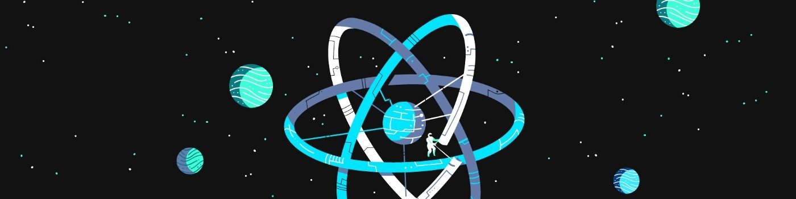

<h1 align="center">
  Welcome to Mikey's world
</h1>

> Constantly developing human mind

 

<h2>:notebook: Facts that might interest you </h2>

  * :mortar_board: Current university status: **Computer Science graduate & taking the Master course**
  * :money_with_wings: Currently employed at: **[Software Mansion](https://swmansion.com/)**
  * :computer: Position: **FullStack Engineer (React.js & Node.js)**
  * :watch: Experience: **Changing the world since *05.2019***
  * :sushi: Currently working on: **[Async Canvas](https://canvas.async.art) & [Async Art](https://async.art)**
  * :chart: Future goals: **Bring AI power to improve User Interface development...**

